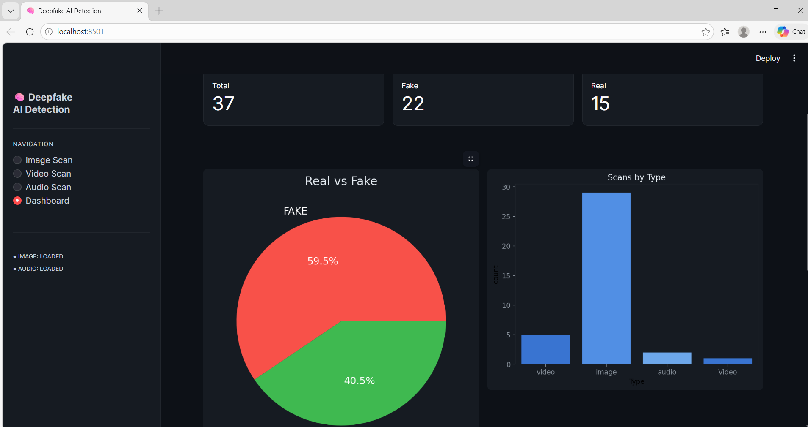
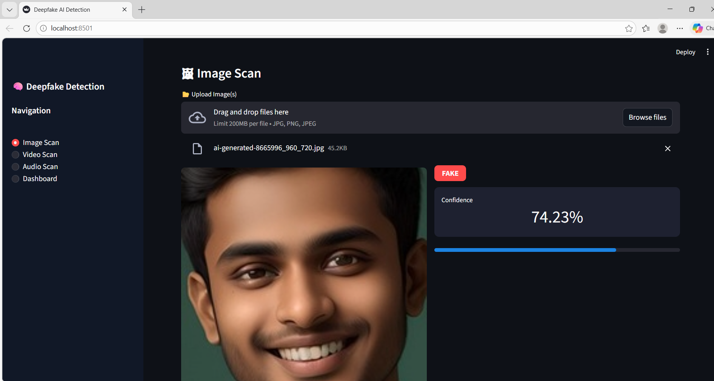

# 🧠 Deepfake AI Detection System

<div align="center">


**A professional-grade, fully offline multimodal deepfake detection tool powered by deep learning.**

[Features](#-features) • [Demo](#-demo) • [Installation](#-installation) • [Usage](#-usage) • [How It Works](#-how-it-works) • [Tech Stack](#-tech-stack)

</div>

---

## 📌 Overview

The **Deepfake AI Detection System** is an offline, AI-powered application that detects manipulated media — images and audio — using deep learning models. Built with Streamlit for an interactive UI, it supports **image analysis**, **audio analysis**, **Grad-CAM visualizations**, and **PDF report generation** — all without requiring an internet connection.

> ⚡ Designed for researchers, journalists, and cybersecurity professionals who need reliable deepfake detection in sensitive environments.

---

## ✨ Features

| Feature | Description |
|---|---|
| 🖼️ **Image Detection** | Detects fake vs real images using a CNN model trained on face data |
| 🎙️ **Audio Detection** | Analyzes mel spectrograms to classify real vs AI-generated audio |
| 🔥 **Grad-CAM Heatmaps** | Highlights suspicious facial regions using gradient class activation maps |
| 📊 **Region Analysis** | Breaks down activation scores for 8 facial regions (eyes, nose, mouth, etc.) |
| 📄 **PDF Reports** | Auto-generates detailed scan reports for single and batch analyses |
| 🗃️ **Scan History** | Logs all past scans in a local database for audit trails |
| 🌐 **Fully Offline** | No internet required — all models and processing run locally |

---

## 🎬 Demo

<div align="center">



*Interactive Streamlit Dashboard*



</div>

---

## 🛠️ Installation

### Prerequisites
- Python 3.9 or higher
- pip package manager

### Step 1: Clone the Repository
```bash
git clone https://github.com/puttasainitish45/deepfake-detection.git
cd deepfake-detection
```

### Step 2: Install Dependencies
```bash
pip install -r requirements.txt
```

### Step 3: Add Trained Models
Place your trained model files inside a `models/` directory:
```
models/
├── image_model (2).h5    # CNN model for image classification
└── audio_model (1).h5    # Model for audio spectrogram classification
```

> 💡 **No models?** The app runs in **Demo Mode** with simulated predictions so you can explore the UI without trained weights.

### Step 4: Run the App
```bash
streamlit run app.py
```

Then open your browser at `http://localhost:8501`

---

## 🚀 Usage

1. **Upload Media** — Upload an image (JPG/PNG) or audio file (WAV/MP3) through the sidebar.
2. **Analyze** — Click the detect button to run inference.
3. **View Results** — See the REAL/FAKE verdict with a confidence score.
4. **Explore Heatmap** — View Grad-CAM overlays showing which face regions triggered the prediction.
5. **Download Report** — Export a detailed PDF report of the scan.

---

## 🔬 How It Works

### Image Detection Pipeline
```
Input Image → Face Detection (OpenCV) → Resize to 224×224 → 
Normalize → CNN Model → REAL / FAKE + Confidence Score
```
- Uses **Grad-CAM** to generate attention heatmaps on the last convolutional layer
- Divides the face into **8 regions** (Forehead, Eyes, Nose, Mouth, Chin, Ears) and scores each

### Audio Detection Pipeline
```
Audio File → Load with Librosa → Mel Spectrogram (128 bins) → 
Resize to 128×128 → 3-Channel RGB → Model (×5 averaged) → REAL / FAKE
```
- Averages **5 predictions** and trims extremes for stable results
- Uses a threshold of `0.45` for classification (tuned for recall on fake audio)

---

## 📁 Project Structure

```
deepfake-detection/
│
├── app.py                  # Main Streamlit application
├── predict.py              # Model loading & inference logic (Grad-CAM, predictions)
├── requirements.txt        # Python dependencies
│
├── models/
│   ├── image_model.h5      # Trained image classification model
│   └── audio_model.h5      # Trained audio classification model
│
├── utils/
│   ├── image_utils.py      # Face detection, heatmap overlay, region extraction
│   ├── video_utils.py      # Video frame analysis
│   ├── audio_utils.py      # Mel spectrogram extraction, frequency analysis
│   ├── db_manager.py       # SQLite scan history management
│   └── pdf_generator.py    # PDF report generation (ReportLab)
│
├── temp/                   # Temporary uploaded files
├── reports/                # Generated PDF reports
│
├── dashboadpy.png          # Dashboard screenshot
└── image.proj.png          # Project overview image
```

---

## 📦 Tech Stack

| Library | Purpose |
|---|---|
| `streamlit` | Interactive web UI |
| `tensorflow` | Deep learning model inference |
| `opencv-python-headless` | Image processing & face detection |
| `librosa` | Audio loading & mel spectrogram extraction |
| `reportlab` | PDF report generation |
| `matplotlib` / `seaborn` | Data visualization |
| `numpy` / `pandas` | Numerical & data operations |
| `Pillow` | Image handling |

---

## 📋 Requirements

```
streamlit
tensorflow
opencv-python-headless
librosa
reportlab
matplotlib
seaborn
numpy
Pillow
pandas
```

Install all with:
```bash
pip install -r requirements.txt
```

---

## 🤝 Contributing

Contributions are welcome! Feel free to:
- 🐛 Report bugs by opening an issue
- 💡 Suggest new features
- 🔧 Submit pull requests

---
## 👨‍💻 Author

**Putta Sai Nitish**

[](https://github.com/puttasainitish45)

---

<div align="center">

</div>
